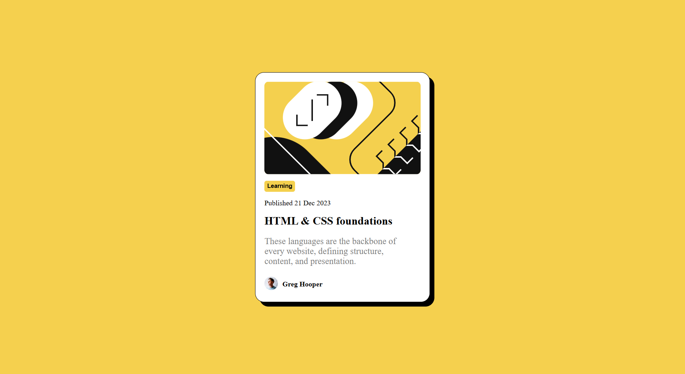
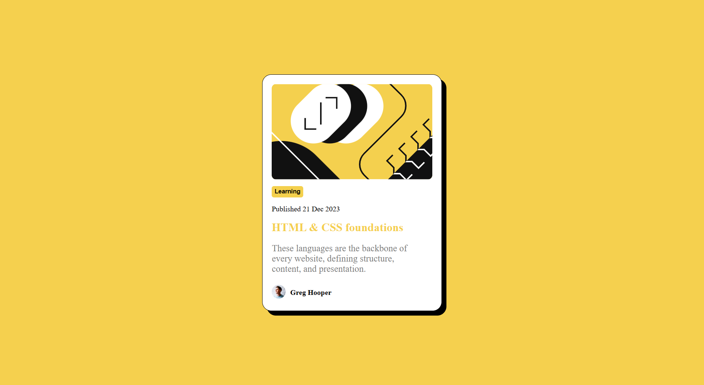
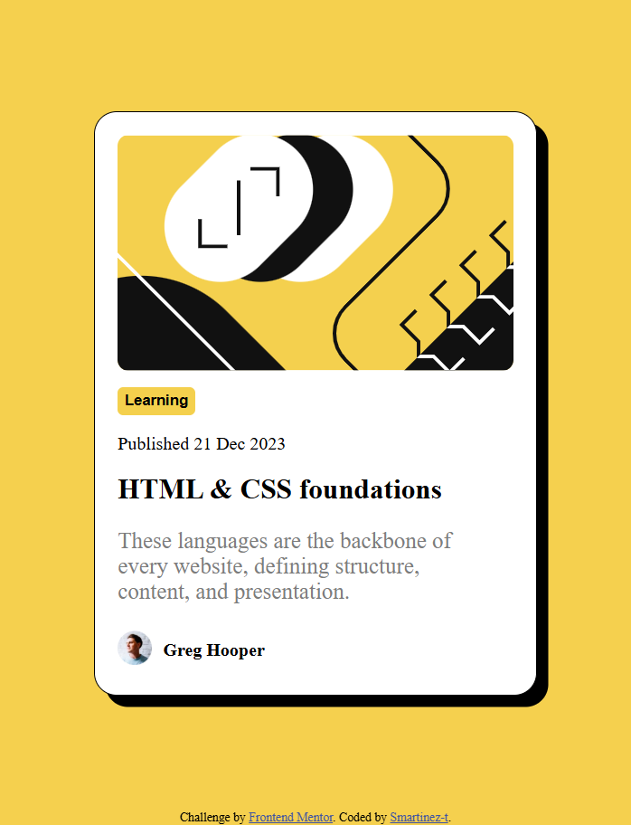

# Frontend Mentor - Blog preview card solution

This is a solution to the [Blog preview card challenge on Frontend Mentor](https://www.frontendmentor.io/challenges/blog-preview-card-ckPaj01IcS). Frontend Mentor challenges help you improve your coding skills by building realistic projects. 

## Table of contents

- [Overview](#overview)
  - [The challenge](#the-challenge)
  - [Screenshot](#screenshot)
  - [Links](#links)
- [My process](#my-process)
  - [Built with](#built-with)
  - [What I learned](#what-i-learned)
- [Author](#author)

## Overview

### The challenge

Users should be able to:

- See hover and focus states for all interactive elements on the page

### Screenshot

-Full Webpage:

-Hover:

-Phone view: 

### Links

- Solution URL: https://github.com/smartinez-t/Frontend-Mentor-blog-preview-card-main
- Live Site URL: https://smartinez-t.github.io/Frontend-Mentor-blog-preview-card-main/

## My process

### Built with

- Semantic HTML5 markup
- CSS custom properties
- Flexbox
- Mobile-first workflow

### What I learned

How to set up the footer as "fixed" even when I have the whole body centered with flex. 

## Author

- Website - [Smartinez-t](https://github.com/smartinez-t)
- Frontend Mentor - [@smartinez-t](https://www.frontendmentor.io/profile/@smartinez-t)
